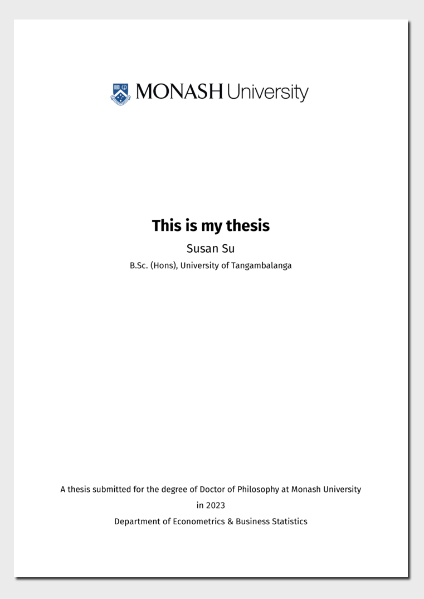

<!-- README.md is generated from README.qmd. Please edit that file -->

# Monash Thesis Template

This is a Quarto template that assists you in creating a Monash
University thesis.

## Installation

You can create a thesis based on this template with the following
command:

``` bash
quarto use template quarto-monash/thesis
```

This will install the extension and create the files that you can use as
a starting place for your thesis.

[](examples/template.pdf)
